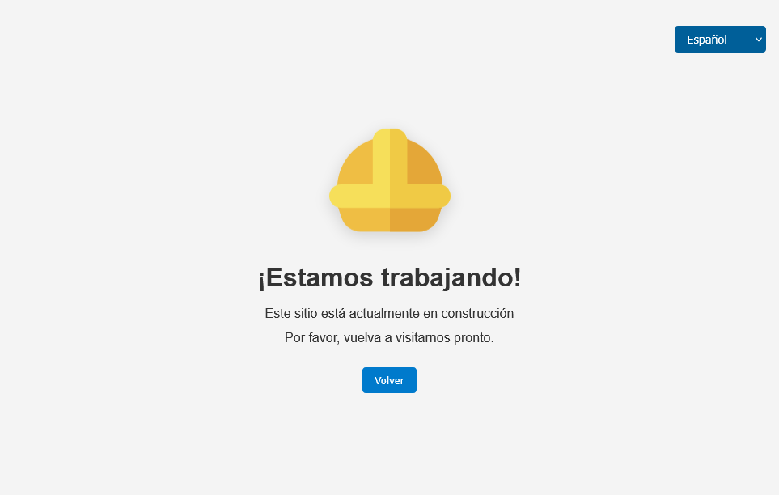

# Work-in-Progress Template 🚧

A minimalist and responsive HTML template for websites under construction.It includes:

- Animated SVG icon
- Responsive layout
- Multilanguage support (with easy extension)
- Clean CSS and JavaScript separation

## 🔧 Features

- 🌐 Language switcher (Spanish, English, Portuguese and German by default)
- 📱 Mobile-friendly (responsive design)
- 🎨 SVG with float animation (CC0 license)
- ⚙️ Fully customizable and fork-ready
- 🍃 Lightweight (no external dependencies)

## 🧰 How to Use

1. **Clone or fork this repository**
   ```bash
   git clone https://github.com/your-user/work-in-progress-template.git
   cd work-in-progress-template
   ```
2. **Edit the content** in `index.html`, `style.css`, and `script.js` as needed.
3. **Customize languages** in the JavaScript object or extend with more `<option>` values.
4. **Host it with GitHub Pages** or any static web host.

## 🌍 Live Preview

You can view a live demo at:
**https://quantumrevenant.github.io/work-in-progress-template/**
(Replace with your GitHub Pages link)

### 📦 Contenido de terceros

Este proyecto puede incluir recursos visuales o de otro tipo bajo licencias abiertas (por ejemplo, CC0, MIT, etc.).

- **Icono SVG**:
  [Worker Helmet – SVG Repo](https://www.svgrepo.com/svg/283156/worker-helmet)
  Licencia: [CC0 1.0 Universal (Public Domain)](https://creativecommons.org/publicdomain/zero/1.0/)

> Nota: Todos los recursos utilizados son opcionales y se pueden reemplazar o eliminar según las necesidades del desarrollador.

## 📝 License

This project is licensed under the MIT License.
See the [LICENSE](LICENSE) file for details.

## 📬 Contact

If you'd like to suggest improvements or ask questions:

[%09--%40QuantumRevenant-%23000000.svg?logo=X&logoColor=white)](https://twitter.com/QuantumRevenant)
[](https://github.com/QuantumRevenant)

---

Feel free to fork and adapt the template for your own needs!
